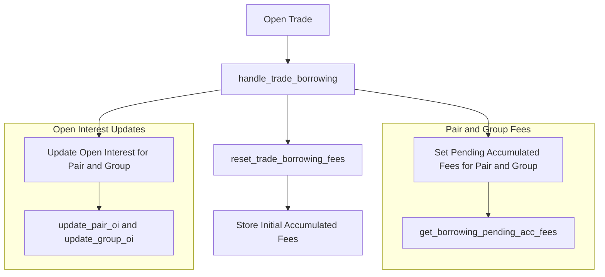

# Perp: Borrowing Groups 

The **Borrowing Module** is a crucial part of the perpetual futures trading system. Its primary responsibilities include:

- **Calculating and accumulating borrowing fees** for leveraged positions.
- **Tracking open interest (OI)** for trading pairs and borrowing groups.
- **Enforcing exposure limits** to ensure trading activity remains within defined thresholds.

This document explains how the borrowing process works—from how **borrowing groups** are structured to the logic that updates them. It also covers the lifecycle of borrowing fees, from when a trade is opened until it is closed or liquidated.

---

## Key Components

### Data Structures

1. **BorrowingData**

   - **Purpose**: Stores fee rates and the accumulated fees for both pairs and groups.
   - **Fields**:
     - `fee_per_block`: Base fee rate per block.
     - `acc_fee_long`: Accumulated fee for long positions.
     - `acc_fee_short`: Accumulated fee for short positions.
     - `acc_last_updated_block`: Block number of the most recent fee update.
     - `fee_exponent`: Adjusts sensitivity for fee calculation based on open interest imbalances.

2. **BorrowingPairGroup**

   - **Purpose**: Captures the historical group associations for borrowing pairs.
   - **Fields**:
     - `group_index`: Identifier for the borrowing group.
     - `block`: Block number at which the group association was set.
     - `initial_acc_fee_long`: Initial accumulated fee for long positions.
     - `initial_acc_fee_short`: Initial accumulated fee for short positions.
     - `prev_group_acc_fee_long`: Previous group's accumulated fee for long positions.
     - `prev_group_acc_fee_short`: Previous group's accumulated fee for short positions.
     - `pair_acc_fee_long`: Accumulated fee for the pair's long positions at the time of group change.
     - `pair_acc_fee_short`: Accumulated fee for the pair's short positions at the time of group change.

3. **OpenInterest**

   - **Purpose**: Tracks open interest (total position sizes) for both pairs and groups.
   - **Fields**:
     - `long`: Total open interest for long positions.
     - `short`: Total open interest for short positions.
     - `max`: Maximum allowable open interest.

4. **BorrowingInitialAccFees**
   - **Purpose**: Records initial accumulated fees for a trade at the moment it opens.
   - **Fields**:
     - `acc_pair_fee`: Pair's accumulated fee when the trade opened.
     - `acc_group_fee`: Group's accumulated fee when the trade opened.
     - `block`: Block number when the trade was opened.

### Storage Maps

- **`PAIRS`**: Stores `BorrowingData` for each trading pair.
- **`PAIR_GROUPS`**: Stores a list of `BorrowingPairGroup` records for each pair (capturing historical group changes).
- **`PAIR_OIS`**: Stores `OpenInterest` for each pair.
- **`GROUPS`**: Stores `BorrowingData` for each borrowing group.
- **`GROUP_OIS`**: Stores `OpenInterest` for each borrowing group.
- **`INITIAL_ACC_FEES`**: Stores `BorrowingInitialAccFees` for each trade.

---

## Borrowing Groups

### What is a Borrowing Group?

A **Borrowing Group** is a set of trading pairs that share common borrowing parameters. It simplifies fee management and exposure control by allowing:

- **Collective fee adjustments**: Update borrowing fees for multiple pairs simultaneously.
- **Shared exposure limits**: Manage cumulative open interest across all pairs in the group.

### Role of Borrowing Groups

- **Fee Adjustments**: Updates borrowing fees in response to market conditions—affecting all pairs in the group at once.
- **Exposure Control**: Aggregates open interest to ensure the group's overall risk remains within acceptable limits.
- **Historical Fee Tracking**: Logs when pairs change groups so that fee calculations remain accurate for open trades.

---

## How Borrowing Groups Are Updated

### Setting Borrowing Group Parameters

Use `set_borrowing_group_params` to create or update a borrowing group's parameters:

- **Key Parameters**:

  - `fee_per_block`: Base borrowing fee rate per block.
  - `fee_exponent`: Exponent to scale fees based on open interest imbalances.
  - `max_oi`: Maximum allowable open interest for the group.
  - `current_block`: Current block number (for fee updates).

- **Process**:
  1. **Validation**: Ensures `fee_exponent` is within allowed bounds (1% to 300%).
  2. **Update Accumulated Fees**: Calls `set_group_pending_acc_fees` to synchronize the group's fees up to `current_block`.
  3. **Store New Data**: Updates the group's parameters in `GROUPS`.
  4. **Adjust Open Interest Limit**: Sets `max_oi` in `GROUP_OIS`.

### Changing a Pair's Borrowing Group

When calling `set_borrowing_pair_params` to place a pair in a new borrowing group:

- **Key Parameters**:

  - `group_index`: The new group index to assign to the pair.

- **Process**:
  1. **Fee Synchronization**: Updates fees for both the old and new groups via `set_group_pending_acc_fees`.
  2. **Open Interest Update**: Removes the pair's open interest from the old group and adds it to the new group using `update_group_oi`.
  3. **Record Group Change**: Appends a new `BorrowingPairGroup` entry to `PAIR_GROUPS`, capturing relevant fee data and the block number.
  4. **Update Pair Data**: Adjusts any pair-specific borrowing parameters in `PAIRS`.

### Updating Open Interest

Open interest is recalculated whenever trades open or close:

- **Key Functions**:

  - `update_pair_oi`: Updates pair-level open interest in `PAIR_OIS`.
  - `update_group_oi`: Updates group-level open interest in `GROUP_OIS`.

- **Process**:
  - **Opening a Trade**: Increases the `long` or `short` OI depending on the trade's direction.
  - **Closing a Trade**: Decreases the `long` or `short` OI accordingly.

---

## Logic Behind Updates

### Accumulating Borrowing Fees

Borrowing fees grow over time, affected by OI imbalances:

- **Fee Formula**:

  ```
  delta = fee_per_block * (current_block - acc_last_updated_block) * (net_oi / max_oi) ^ fee_exponent
  ```

  - `fee_per_block`: Base fee rate per block.
  - `current_block - acc_last_updated_block`: Blocks elapsed since the last fee update.
  - `net_oi`: Absolute difference between `long` and `short` OI.
  - `max_oi`: Maximum allowed open interest (for the pair or group).
  - `fee_exponent`: Exponent that increases fees exponentially with larger OI imbalances.

- **Side-Specific Fee Accumulation**:
  - Fees accrue only on the side (long or short) that has the larger open interest, incentivizing a more balanced market.

### Handling Trades

#### Opening a Trade

When a new trade is opened:

- **Function**: `handle_trade_borrowing`
  - **Fee Synchronization**: Calls `set_pair_pending_acc_fees` and `set_group_pending_acc_fees` to update fees.
  - **Open Interest**: Updates pair and group OI via `update_pair_oi` and `update_group_oi`.
  - **Initial Fee Recording**: Invokes `reset_trade_borrowing_fees` to log the accumulated fees at the time the trade opens.

#### Closing a Trade

When an existing trade closes:

- **Function**: `handle_trade_borrowing`
  - **Fee Synchronization**: Updates fees up to the current block.
  - **Open Interest**: Reduces the pair and group OI (long or short) accordingly.
- **Borrowing Fee Calculation**:
  - **Function**: `get_trade_borrowing_fees`
    - Computes the difference between the fees at closure vs. the `INITIAL_ACC_FEES` from trade open.
    - Accounts for any group changes that happened during the trade.

### Adjusting for Group Changes

If a pair moves to a new group while a trade is open:

- **Challenge**: The position's borrowing fees must reflect fees from both the old group and the new group.
- **Solution**:
  - Use `get_borrowing_pair_group_acc_fees_deltas` to determine the fee delta across group transitions.
  - Sum the larger of (pair delta, group delta) for each period to get total fees.

### Calculating Liquidation Price with Fees

To calculate liquidation prices, including borrowing fees:

- **Function**: `get_trade_liquidation_price_with_fees`
  - **Includes**:
    - Closing fees (e.g., close fee, trigger order fee)
    - Borrowing fees from `get_trade_borrowing_fees`
  - **Purpose**: Computes the final liquidation price after deducting all fees.

---

## Process Flow Summary

A high-level look at how trades interact with the Borrowing Module:

1. **Trade Opening**

   - **User Action**: Opens a new trade.
   - **System**:
     1. Uses `handle_trade_borrowing` to sync fees and update OI.
     2. Stores initial accrued fees in `INITIAL_ACC_FEES`.

2. **During Trade**

   - **System**:
     - Continues to accumulate fees over time (not updated in storage unless an event triggers an update, like another trade).

3. **Trade Closing**

   - **User Action**: Closes an existing trade.
   - **System**:
     1. Calls `handle_trade_borrowing` to update fees and OI.
     2. Uses `get_trade_borrowing_fees` to compute the total borrowing fees.
     3. Finalizes the trade, deducting any closing fees and borrowing fees.

4. **Parameter Updates**
   - **Admin Action**: Updates group or pair parameters.
   - **System**:
     1. Syncs fees up to the current block.
     2. Updates open interest if a pair's group changes.

---

## Detailed Function Explanations

### `handle_trade_borrowing`

**Purpose**: Coordinates the borrowing logic whenever a trade opens or closes.

**Workflow**:

1. **Pending Fees Update**: Invokes `set_pair_pending_acc_fees` and `set_group_pending_acc_fees`.
2. **Open Interest Update**: Adjusts OI via `update_pair_oi` and `update_group_oi`.
3. **Reset Initial Fees** (for new trades): Stores current fees in `INITIAL_ACC_FEES`.

### `get_trade_borrowing_fees`

**Purpose**: Calculates total borrowing fees for a trade upon closure.

**Workflow**:

1. **Load Initial Fees**: Retrieves `INITIAL_ACC_FEES` for the trade.
2. **Compute Current Fees**: Uses `get_direction_borrowing_pair_pending_acc_fees` and `get_direction_borrowing_group_pending_acc_fees`.
3. **Group Transition Handling**: Applies `get_borrowing_pair_group_acc_fees_deltas` for fee periods affected by group changes.
4. **Final Fee Calculation**: `(Current Acc Fees - Initial Acc Fees) * (Trade Collateral * Leverage)`.

### `get_borrowing_pending_acc_fees`

**Purpose**: Calculates the additional fees that accumulated between the last update and the current block.

**Workflow**:

1. **Identify OI Imbalance**: Determines whether long or short positions exceed the other.
2. **Calculate Fee Delta**: Uses the fee formula to calculate newly accrued fees.
3. **Add Fee Delta**: Applies the calculated delta to either `acc_fee_long` or `acc_fee_short`.

### `reset_trade_borrowing_fees`

**Purpose**: Logs the borrow-related fees at the moment a trade is opened.

**Workflow**:

- Saves the current `BorrowingData` for both pair and group into `INITIAL_ACC_FEES`, including the current block number.

---

## Example Scenario

Consider a pair that transitions from **Group A** to **Group B** while a trade is open:

1. **Block 100**

   - **Trade Opened**:
     - Trader opens a long position on Pair X.
     - Pair X is in **Group A**.
     - Accumulated Fees: 2% for the pair, 1% for the group.
     - Initial fees are recorded in `INITIAL_ACC_FEES`.

2. **Block 150**

   - **Group Change**:
     - Pair X is moved from **Group A** to **Group B**.
     - System updates all relevant fees for Group A up to Block 150, then assigns Pair X to Group B.
     - The group transition is recorded in `PAIR_GROUPS`.

3. **Block 200**
   - **Trade Closed**:
     - System updates fees for Pair X and Group B up to Block 200.
     - It calculates borrowing fees via `get_trade_borrowing_fees`:
       - Considers the 2%/1% from **Group A** until Block 150.
       - Includes the new rates from **Group B** from Block 150 to 200.
     - Final settlement occurs, including close fees and borrowing fees.

---

## Visualization of Logic Flow



---

## Key Takeaways

The Borrowing Module is vital to mastering the perpetual futures platform. It ensures accurate fee accrual, consistent open interest tracking, and robust exposure management.

- **Borrowing Groups**: Centralize exposure limits and streamline fee adjustments for multiple pairs.
- **Accumulated Fees**: Updated based on time, OI imbalances, and fee parameters.
- **Open Interest**: Tracked at both the pair and group level, essential for risk control.
- **Trade Lifecycle**:
  - **Opening** a trade sets the initial fees.
  - **Closing** a trade calculates total borrowing fees and updates open interest.

By carefully managing how trades interact with pairs and borrowing groups, the module ensures fairness, clarity, and security for leveraged traders and the platform as a whole.
